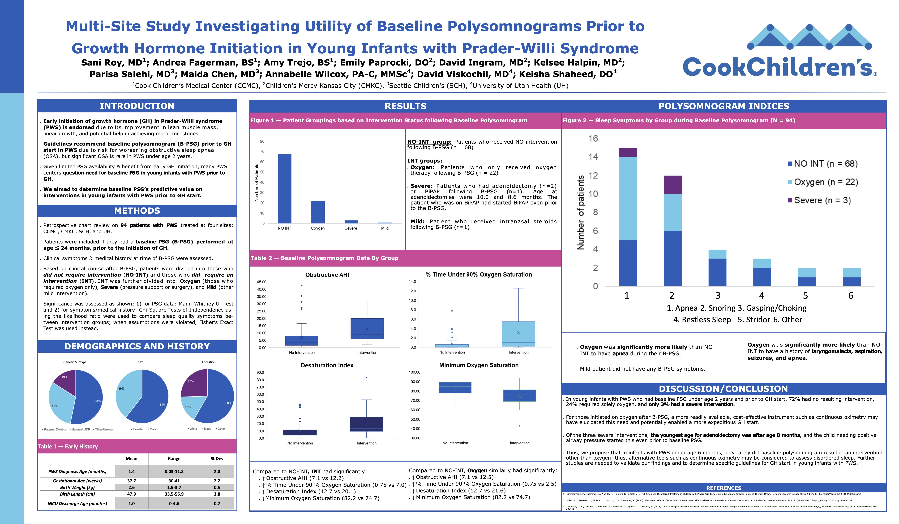
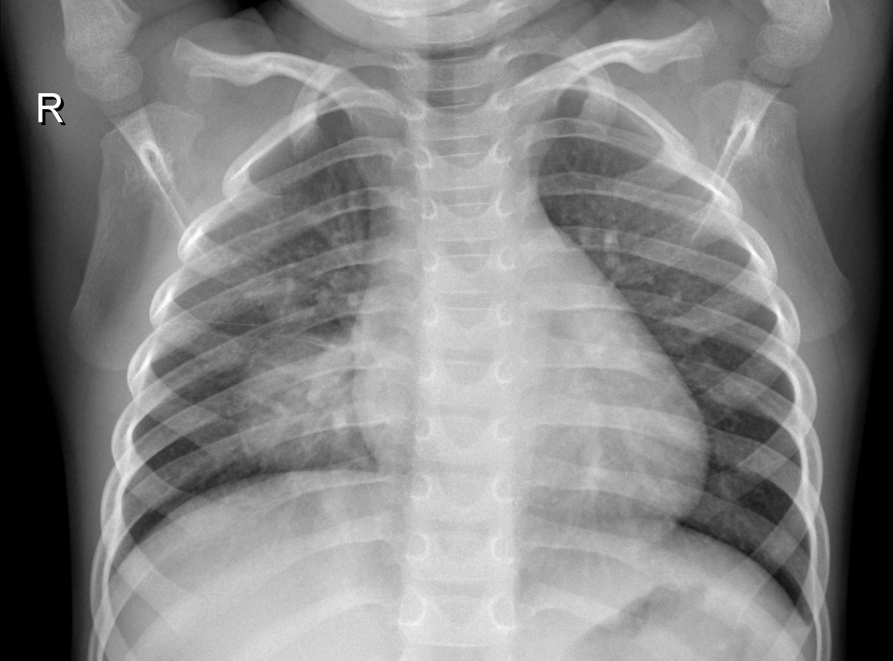
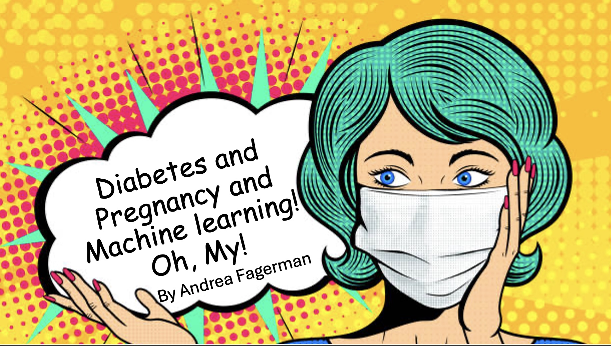

# Data Scientist and Bioinformatician
- Programming Languages: Python, SQL, R
- Statistical Software/Other: SPSS, Excel, Matlab, DataBricks
- Accreditations/Certificates: Epic Cosmos for Data Scientist, Epic Cosmos Data Model for Data Architects

### Education
- Bioinformatics and Computational Biology, MS - May 2025

  University of Texas at Dallas, GPA: 3.9
    - Data Science Certificate
- Biochemistry, BS - May 2019

  University of North Texas, GPA: 3.8
    - Minor in Spanish
    
### Projects
- MultiSite Prader-Willi Syndrome (PWS) Sleep Study October 2024-Present

  I am currently working with Dr Roy at Cook Children's Medical Center to examine the need for a baseline polysomnogram (PSG) prior to Growth Hormone (GH) initiation. We teamed up with three other hospitals (Children's Mercy Kansas City, Seattle Children's Hospital, and University of Utah Health) to collect all the data on PWS patients who had a baseline PSG younger than 2 years of age and prior to GH initiation from birth to 3 years of age. I cleaned, processed, and analyzed the various groups using Chi-Squared Test of Independence, Mann Whitney U Test, Kruskal-Wallis Test, and Wilcoxon Signed Ranked Test. This data was presented in a poster, as seen below, in May 2025 at the Pediatric Endocrine Society Conference and is awaiting publication.
  

-<a href="https://onlinelibrary.wiley.com/doi/10.1002/ajmg.a.64121" target="_blank" rel="nofollow noopener noreferrer"> Dysphagia and Silent Aspiration in PWS Infants</a>

  In this study, I retroactively examined pediatric PWS patients who received at least one Videofluoroscopic Swallow Study (VFSS). Through this study, it was found that dysphagia was present in 100% of 1st VFSS and aspiration was noted in 38.9% of 1st VFSS. In all cases of aspiration in initial or subsequent VFSS, 100% were silent and presented no clinical signs.

-<a href="https://github.com/andreagf1996/ClassifyingChestXRays" target="_blank" rel="nofollow noopener noreferrer"> Chest X-Ray Pneumonia Classification Project</a>

  In this project, seen on my Github profile, I built a neural network in order to identify if an x-ray indicated a patient had pneumonia or was normal.

-<a href="https://github.com/andreagf1996/portfolio/blob/main/stats%20prok.pptx" target="_blank" rel="nofollow noopener noreferrer">Gestational Diabetes Prediction Model</a>

  In this project, seen on my Github profile, I used Random Forest to predict whether women would have gsetational diabetes or not. I found that despite numerous women missing their blood glucose levels in the data, which would otherwise be used to determine diabetes status, when replacing missing blood glucose with the mean for the overall population and when other factors were taken into account, this model was highly accurate in predicting the outcome as seen by the F1 and ROC AUC. 
  

### Work Experience
**Cook Children's Health Care System**

<ins>Assistant Research Scientist - Mar 2025 - Present</ins>
- Supporting the development of the Precision Medicine department to advance treatment strategies and improve patient outcomes.
- Collaborating and consulting with various institutions and specialties to foster research initiatives that directly impact patient care.
- Integrating and optimizing software platforms to streamline data management, enabling more efficient and accurate clinical decision-making.
- Providing statistical expertise to ensure high-quality data analysis, supporting evidence-based approaches to patient treatment and care.
  
<ins>Clinical Research Intern - Aug 2024 - Mar 2025</ins>
- Collected, cleaned, and analyzed clinical research data on Prader-Willi syndrome using SPSS, Excel, and REDCap.
- Led data management and statistical analysis for a study on swallow studies in Prader-Willi syndrome patients, contributing to a forthcoming publication.
- Managed stakeholder expectations by communicating study progress and findings, ensuring alignment with research objectives.
- Provided statistical guidance and interpretation to support data-driven decision-making in clinical research.

**Grapevine-Colleyville ISD** 

<ins>Science Educator - Jan 2023 - July 2023</ins>
- Taught 150+ students how to collect, analyze, interpret, and present laboratory data.
- Collaborated with co-teachers to meet student experimental and lesson objectives.
- Collected and analyzed student data, including test scores, assignments, and self-reported data, to meet individual student and district academic goals, monitor knowledge retention, and improve curriculum. 
- Performed audits in the student grade databases quarterly. Provided feedback to students and achieved over 95% pass rate.
- Maintained weekly communication with parents, administrators, behavioral specialists, and other educators, utilizing strong tracking and time management skills. 
- Consulted local law enforcement and fire departments for legal advisement, planning interdisciplinary activities for students. Designed, proposed, communicated, and organized inter-city arson investigation activity for forensic science students and the local fire department.
- Designed hands-on forensic labs for students to practice analytical skills and application of knowledge.
- Utilized Google Suite to collaborate with other teachers, students, and administration officials.

**Uplift Education**

<ins>Science Educator - Aug 2020 - Aug 2022</ins>
- Conducted routine performance analysis to drive academic decisions.
- Managed and updated student databases on a weekly basis; utilized data analysis techniques to determine classroom learning needs, identify at-risk individuals, track knowledge retention, and improve course content. 
- Developed lesson plans, course material, and hands-on learning activities. Created and facilitated a learning-oriented environment that encouraged new ideas and creativity.
- Maintained weekly communication with parents administrators, behavioral specialists, and other educators, requiring strong tracking and time management skills.
- Achieved 98.4% of students passing state-required subject testing for graduation. Met district performance goals in 2020 and was one of only six at the school to earn that recognition.
- Managed 150+ students with varied needs and special accommodations.

### A little about me... 
When I'm not working, you can find me with my pups on a hike, learning some new skills on Udemy or Coursera, painting, or working out at the gym. 

Me gusta practicar mi español y ver muchos cortometrajes en LingoPie. También me encanta encontrar hispanohablantes con quienes practicar español. (Es muy divertido!)

If you're curious to learn more about me, please feel free to reach out through my [LinkedIn!](https://www.linkedin.com/in/andrea-fagerman-817317193)
